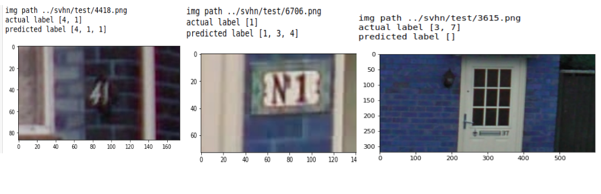

# Problem Statement

Objective: Create a solution to read house numbers in the 100 images attached (testsvhn.zip) using deep learning/ machine learning. You can use the full SVHN dataset (http://ufldl.stanford.edu/housenumbers/) for training purposes. You can use the machine learning framework of your choice. You don't have to train models for very long - a high or low accuracy will not determine our review of your solution. You can use any existing open source implementation as well, and don't have to implement your solution from scratch, if it helps. You can also use pre-trained models as a starting point for your training, if you wish.     

Please Add below Listed Execution files to be included in the test Project.
   "Please have a few more examples such as **test82.png, test36.png, test70.png, test10.png** for us to get a sense of his hands-on experience. If there's a new project zip he can submit taking this into consideration, would be good to get a sense of the ideas and thought process

# Approaches with implementation details 

**Please go through this repo for details of implementation**

https://github.com/trinanjan12/svhn_digit_recognizer

3 different approaches that I have tried to solve the problem are listed below

1. Object Detection using Yolov5
2. Object Detection using Detectron 2
3. Multilabel Classification  

## My Final Submission is Yolov5 output
### I am attaching outputs from Yolov5 and Detectron2

## 1. Object Detection using YOLOV5

### Output of the test dataset provided
**The first value after --> is the class predicted**

### Output of the test dataset of SVHN
#### Good Output

#### Bad Output

## 2.Object Detection using Detectron2

#### Output of the test dataset provided

### Output of the test dataset of SVHN
#### Good Output

#### Bad Output

